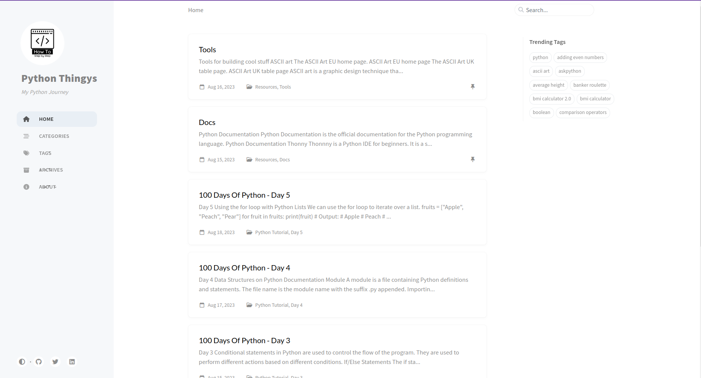

# About Python Thingys

This is a private blog of my journey in learning Python. It is a collection of my notes and important things I learned along the way.

I hope you find it useful.

{: .prompt-danger}

**Note:**

- The information on this site may not be suitable for beginners.
- I have a few years of JavaScript under my belt, so I tend to put mostly information that is new to me with my current programming knowledge level.
- I am still learning and I am still adding content to this site. 😊 {: .alert .alert-warning}

---

---

---

This site was built using the amazing jekyll theme [Chirpy](https://github.com/cotes2020/jekyll-theme-chirpy/) by [Cotes Chung](https://github.com/cotes2020)! 🤩

## Useful links:

- [Jekyll Theme Chirpy](https://rubygems.org/gems/jekyll-theme-chirpy)
- [Chirpy Theme](https://github.com/cotes2020/jekyll-theme-chirpy/)
- [Chirpy GitHub Template](https://github.com/cotes2020/chirpy-starter/generate)
- [License MIT](https://github.com/cotes2020/chirpy-starter/blob/master/LICENSE)

### Chirpy Starter  [][mit]
